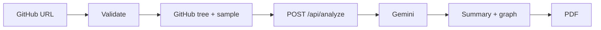

# Quiremap

Paste a public GitHub URL. Get a one-page architecture briefing and a living map of how the pieces connect. Download it as a PDF.

No accounts, no database, no leftover data. The browser (or, if GitHub throttles you, the server) reads the repo. Gemini writes the briefing. The API key never ships in the client bundle.

**Tagline:** See the shape of any codebase.

---

## Features

- URL validation before any network call
- GitHub tree fetch with intelligent file sampling (not the whole repo)
- Architecture summary, key modules, language chips, monorepo notes
- Interactive force-directed graph (pan, zoom, hover to isolate connections)
- Client-side PDF one-pager (summary + graph layout, not a screenshot dump)
- Staged loading that tracks fetch → sample → analyze → graph
- Session cache so the same repo in the same tab is not re-analyzed
- `prefers-reduced-motion` support

## How it works



1. The client checks that the input is a GitHub repo URL (`github.com/owner/repo`, `.git`, `/tree/...` all fine).
2. It loads repo metadata and the recursive git tree from GitHub’s REST API (**2 calls**). File bodies come from `raw.githubusercontent.com` and **do not** count against the REST 60/hour cap.
3. A heuristic picks README, manifests, entrypoints, and a scored slice of source.
4. That payload is posted to `POST /api/analyze`. If the browser is GitHub-rate-limited, the client sends `{ repoUrl, fetchOnServer: true }` and the server fetches GitHub instead.
5. The server calls Gemini (`gemini-3.1-flash-lite`, then `gemini-3.6-flash` / `gemini-3.5-flash` if needed), asks for JSON (summary, components, nodes + edges), validates the graph, and returns the briefing.
6. The UI renders typography + a d3-force graph. **Download PDF** draws a document with jsPDF.

The Gemini key is read only on the server (`api/analyze.ts` on Vercel, Vite middleware locally). Never prefix it with `VITE_`.

## File-selection heuristic

The model never sees the entire tree. Caps exist so prompts stay fast and cheap, even though Gemini’s context window is large.

| Step | Rule |
| --- | --- |
| Prefer | `README*`, manifests (`package.json`, `pyproject.toml`, `go.mod`, `Cargo.toml`, `requirements.txt`, Docker/Make/tsconfig, workspace files), conventional entrypoints (`main.ts`, `app.py`, `src/index.*`, `lib.rs`, …) |
| Skip | `node_modules`, `dist`, `vendor`, caches, binaries, media, minified bundles, lockfiles |
| Score | Shallower paths score higher; files matching the repo’s primary language score higher; tests, mocks, fixtures, and stories score lower |
| Cap | About **48 files** and **~220 KB** of source. Files over **80 KB** are dropped or truncated |
| Disclose | The UI marks the result **sampled** when the tree was truncated, huge, or only partially sent |
| Monorepos | Flagged when there are multiple `package.json` files, `apps/` + `packages/`, `pnpm-workspace.yaml`, `go.work`, or `lerna.json` |

Implementation: `shared/selectFiles.ts`.

## Stack

| Layer | Choice |
| --- | --- |
| Runtime | [Bun](https://bun.sh) |
| App | Vite + React 19 + TypeScript |
| Style / motion | Tailwind CSS + Motion |
| Graph | d3-force (SVG) |
| PDF | jsPDF |
| LLM | Gemini API (`@google/genai`) |
| GitHub | REST API + raw content URLs |
| Host | Vercel (static + `api/analyze.ts`) |

## Prerequisites

- [Bun](https://bun.sh) 1.3+
- A [Google AI Studio](https://aistudio.google.com/apikey) Gemini API key
- Optional: a [GitHub personal access token](https://github.com/settings/tokens) if you keep hitting the unauthenticated **60 requests/hour/IP** limit

## Setup

```bash
bun install
cp .env.example .env
```

Edit `.env`:

```env
GEMINI_API_KEY=your_gemini_api_key_here
# Optional. Used only for server-side GitHub fetches.
# GITHUB_TOKEN=ghp_your_token_here
```

```bash
bun run dev
```

Open [http://localhost:5173](http://localhost:5173). Vite serves the SPA and `POST /api/analyze` in the same process.

```bash
bun run build    # typecheck + production bundle
bun run preview  # serve dist/
bun run lint     # oxlint
```

## Environment

| Variable | Where | Required | Purpose |
| --- | --- | --- | --- |
| `GEMINI_API_KEY` | Server only | Yes | Gemini generateContent |
| `GITHUB_TOKEN` | Server only | No | Raises GitHub REST limits for server-side fetches |

Do **not** use a `VITE_` prefix. Those values are inlined into the client bundle.

Unauthenticated GitHub limits are per **public IP**. On a laptop, the browser and `bun run dev` share that quota. If you hit 60/hour, set `GITHUB_TOKEN` or wait for the reset.

## Project layout

```
api/analyze.ts          Vercel serverless entry (POST)
server/handler.ts       Request validation, rate limit, orchestration
server/gemini.ts        Prompt, model fallback, JSON normalize
server/rateLimit.ts     Per-IP throttle (6 analyses / 10 minutes / instance)
shared/                 Types, URL parse, file pick, GitHub collect
src/                    React UI, graph, PDF, session cache
vite-plugin-api.ts      Local /api/analyze via Vite middleware
```

## API

`POST /api/analyze`

**Client already fetched files**

```json
{
  "owner": "expressjs",
  "repo": "express",
  "repoUrl": "https://github.com/expressjs/express",
  "defaultBranch": "master",
  "description": "",
  "primaryLanguage": "JavaScript",
  "totalFiles": 120,
  "truncatedTree": false,
  "likelyMonorepo": false,
  "files": [{ "path": "Readme.md", "content": "..." }]
}
```

**Server should fetch GitHub** (browser rate-limited)

```json
{
  "repoUrl": "https://github.com/expressjs/express",
  "fetchOnServer": true
}
```

Success is a JSON briefing (`architectureSummary`, `components`, `graph.nodes` / `graph.edges`, …). Errors return `{ "error": string, "code": string }` for invalid URLs, 404/private repos, GitHub or Gemini rate limits, empty trees, oversized samples, and model failures.

The endpoint is throttled at **6 requests per IP per 10 minutes** (in-memory, per serverless instance) so Gemini quota cannot be drained with a tight loop.

## Deploy (Vercel)

1. Import the GitHub repo in Vercel (framework Vite, install with Bun is fine).
2. **Environment variables** (Project → Settings → Environment Variables):
   - `GEMINI_API_KEY` — Production **and** Preview. Server-side only. Do **not** name it `VITE_GEMINI_API_KEY`.
   - `GITHUB_TOKEN` — optional, for server-side GitHub fetches.
3. Redeploy after saving env vars (they are not picked up by an already-built deployment).
4. Smoke-check the function: open `https://your-app.vercel.app/api/analyze` in a browser. You should see JSON like `{ "ok": true, "hasGeminiKey": true }`. If `hasGeminiKey` is `false`, the key is not visible to the function.

Gemini keys used on Vercel must allow **server** calls:

- Application restrictions: **None** (HTTP referrer restrictions block serverless).
- Paste **only** the key value — no quotes and no `GEMINI_API_KEY=` prefix.
- After changing env vars, **redeploy**.

The SPA rewrite in `vercel.json` skips `/api/*` so Vite does not swallow the function.

## Limits and privacy

- Public GitHub repos only. Private repos look like 404.
- Graph nodes are capped (~36) so large maps stay readable.
- If Gemini returns unusable graph JSON, the written briefing still renders.
- Successful briefings are stored in `sessionStorage` for that tab only.
- Nothing is written to a database.

## License

Private / unlicensed unless you add one.
